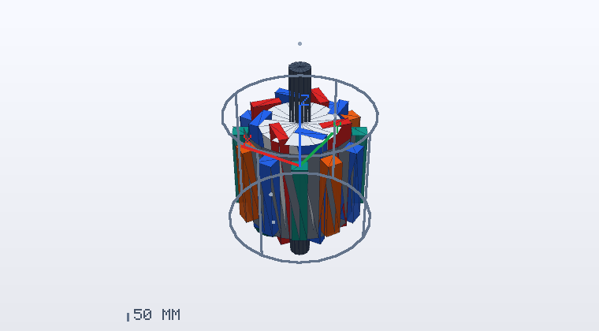
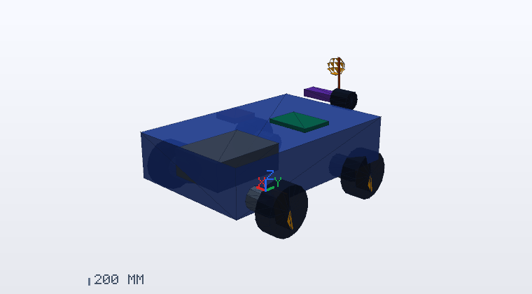

<div align="center">

# ROBOCON 电控实训教室

**从一台电机，到一整台比赛机器人的电控系统。**

[](LICENSE)
[](https://www.python.org/)
[](#安装一分钟一条命令)
[](#测试与验收)
[](#这门课想解决什么问题)

</div>

<p align="center">
  
  
</p>

<p align="center"><sub>以上为实验台的真实渲染输出（<code>tests/render-preview.mjs</code> 离屏渲染，未做手工修图）。</sub></p>

---

## 安装（一分钟，一条命令）

**完全没用过命令行？** 看 [五分钟装上这门课](docs/QUICKSTART.md)，那里是保姆级步骤。

在终端里粘贴这一行、回车，剩下的事它自己做完：

```bash
bash <(curl -fsSL https://raw.githubusercontent.com/tob124/motor-control-tutorial/main/deploy.sh)
```

它会依次：检查环境 → 从 GitHub 下载课程 → 生成课程内容 → 自检 →
询问是否现在启动（启动后自动打开浏览器）。

装好之后，以后每次用：

```bash
cd ~/robocon-control-course
./start.sh          # 停止：按 Ctrl+C
```

然后访问 <http://127.0.0.1:8770/>。

**只需要 Python 3.10 以上。** 不需要 pip、不需要 Docker、不需要联网运行、不会改你的系统配置。

服务端**只用 Python 标准库**；前端是原生 HTML/JS，无构建步骤。
唯一的第三方代码是 `dist/vendor/` 下的 xterm.js（可选终端面板用），
随仓库提供并保留了原始许可证与来源清单——所以不会出现"依赖装不上"的经典问题。

<details>
<summary>其他安装方式（网络受限 / Windows / 想手动来）</summary>

**下载 ZIP（没有 git 时）**
从仓库页面 `Code` → `Download ZIP`，解压后在目录里执行：

```bash
bash install.sh --in-place
```

**只想先看看环境够不够**

```bash
bash install.sh --dry-run
```

**Windows**

推荐用 WSL2（Ubuntu），然后按上面的一行命令安装：

```
wsl --install -d Ubuntu
```

装好后也可以直接双击 `start-windows.bat` 启动（它会优先用 WSL，
没有 WSL 时回退到 Windows 版 Python）。

**可选的容器实验（只有它需要 Docker）**

44 个网页实验台、课程内容、作品导出都**不需要** Docker。
只有"真实 Linux 终端实验"（编译 C、CAN 工具）需要：

```bash
bash scripts/setup-docker.sh --mirror aliyun   # 会先打印改动清单并征求同意
```

</details>


> 课程作者：Connor He。

面向 ROBOCON / RoboMaster 的新电控队员，立足《电机拖动》与《机器人技术》两门课。
11 周、44 个单元、126 道理解题，配一套**实时数值实验台**：
电流环、速度环、位置环、FOC、SVPWM、异步机、差速底盘运动学、电源预算与故障诊断，
全部在本机实时求解，**没有任何预存曲线**。

---

<details open>
<summary><b>目录</b></summary>

- [先启动](#-先启动)
- [这门课想解决什么问题](#这门课想解决什么问题)
- [实验台能做什么](#实验台能做什么)
- [几条刻意的设计决定](#几条刻意的设计决定)
- [目录结构](#目录结构)
- [测试与验收](#测试与验收)
- [可选的容器实验](#可选的容器实验)
- [第三方组件](#第三方组件)
- [许可证](#许可证)

</details>

---

## 先启动

在项目目录执行：

```bash
./start.sh
```

然后打开 <http://127.0.0.1:8770/>。按 Ctrl+C 停止；学习记录保存在 `.state/`。

**不需要 pip、不需要虚拟环境、不需要联网、不需要 Docker。**
服务端只用 Python 3.12 标准库，前端是原生 HTML/JS（无构建步骤、无 CDN）。

```bash
./start.sh --port 8790   # 换端口（默认 8770）
./start.sh --check       # 只做自检，不启动
python3 scripts/build_content.py --check   # 内容一致性校验
python3 -m unittest discover -s tests      # 全部测试（149 项）
```

## 这门课想解决什么问题

很多新队员的第一课是"照着例程调一个电机"：改几个 Kp/Ki，电机转了，就算学会了。
但到了整机阶段，问题会成批出现——一加速就复位、位置永远差一点、
慢速爬行时抖得厉害、改了减速比之后机构推不动、两个电机跑着跑着就打架。

这些问题的答案分布在《电机拖动》（机械特性、变频调速、矢量控制）
与《机器人技术》（运动学、路径跟踪、系统集成）之间，而现场没人给你时间重新学一遍。

所以这门课的路径是**循序渐进的整机设计**：

```
单台电机 → 三相与坐标变换 → 逆变器与调制 → 电流环 → 速度/位置环
    → 电控通信 → 运动学与机构 → 轨迹跟踪 → 整机电源与安全链 → 排障 → 设计包
```

前 5 周把**一台电机**做透；第 6 周把**一个电控节点**做完整；
第 7–8 周把**多个电机**变成**整机运动**；第 9–10 周把整机变成
**可交付、可排障、可复现的系统**；第 11 周产出完整的设计包。

课程地图见 [docs/CURRICULUM_MAP.md](docs/CURRICULUM_MAP.md)。

## 实验台能做什么

| 类别 | 内容 |
|---|---|
| 电机 | 直流机、三相异步机（磁链定子系模型）、永磁同步 / 无刷机（dq 模型） |
| 控制 | 开环、电流环、速度环、位置环、差速底盘 + 纯追踪路径跟踪 |
| 逆变器 | 载波 PWM、七段式 SVPWM、母线限幅、调制比与饱和占比 |
| 曲线族 | 机械特性、转矩—转差、恒压频比、电流环频率响应（扫频测带宽） |
| 整机 | 母线压降与温升、CAN 负载率与抖动、电源预算、四连杆传动比 |
| 故障注入 | 编码器接反、相序接反、母线跌落、机械卡死、CAN 丢帧、量纲混淆、零偏、抖动 |

所有数据可导出为 ZIP（参数 JSON + 原始 CSV + 指标），学习记录可导出为
Markdown 设计包。

## 几条刻意的设计决定

**曲线是算出来的。** 每次运行都在本机实时求解电气—机械耦合微分方程。
每个模型都有与解析解的自动对照测试；如果数值发散，服务会**如实停止并报告**，
绝不会把 NaN 或残缺数据当成曲线画出来。

**故障只作用于反馈与执行通道。** 注入的故障不会篡改物理状态，
所以你看到的是"控制变差"，而不是"数据被美化"。这是训练诊断能力的前提。

**限幅在 PI 内部。** 串级控制中每一级的限幅都落在控制器里面（条件积分抗饱和），
而不是算完在外面夹一下——后者会掩盖积分饱和，让你在参数上白花几个小时。

**不伪造保护。** 模型里真实存在的约束只有母线限幅；电流"超限"只给告警。
过流、过温、堵转保护是第 9–10 周要你**设计**出来的东西。

**如实报告环境。** 没有 Docker 时页面会明确说"真实终端实验不可用"，
而不是把实验判为通过。全部网页功能不受影响。

## 目录结构

```
start.sh                 启动本机服务
server/                  纯标准库后端
  app.py                 路由、内容、进度、导出
  httpd.py               HTTP 服务与安全边界（令牌、来源校验、路径防穿越）
  store.py               sqlite 进度与作品记录
  jobs.py                仿真作业的限流、取消与落盘
  labs.py                可选的 Docker 实验管理
  sim/                   仿真内核
    integrate.py         RK4 与子步规划
    machines.py          直流机 / 异步机 / 永磁机模型
    inverter.py          Clarke/Park、PWM 与 SVPWM
    control.py           PI、抗饱和、编码器、差速运动学、四连杆
    robot.py             母线、CAN、安全链、电源预算
    engine.py            单次仿真的装配与主循环
    scenarios.py         曲线族实验
    spec.py              参数校验（白名单 + 范围 + 单位约定）
    metrics.py           指标（超调、调节时间、带宽…）
dist/                    原生前端（无构建步骤）
  index.html app.js plot.js styles.css
  vendor/                xterm.js（第三方，保留许可证与来源清单）
course/                  由 scripts/build_content.py 生成的内容 JSON
scripts/                 内容源与构建脚本
lab/                     可选的真实终端实验镜像
docs/                    模型说明、教师说明、课程地图
tests/                   物理、接口、内容一致性测试
```

## 界面与交互

- **顶栏一键切换 3D / 2D**，选择会记住；低配机器自动默认 2D
  （按 `navigator.hardwareConcurrency ≤ 2` 判断）。
- **模型可拖动旋转、滚轮缩放**：向右拖 = 相机绕目标向右转，物体屏幕右侧的部分
  转向观察者，即"指针带着画面走"；竖直拖拽抬高或降低俯视角。
- 拖动过之后不再自动重置视角；换电机型号或机器人参数时会重新自动取景。
- 每个模型类型有自己的默认视角：电机需要较高俯角看端面，机器人需要较低俯角看轮子。
- 尊重系统的"减少动态效果"设置（`prefers-reduced-motion`）。

## 测试与验收

```bash
python3 -m unittest discover -s tests
```

149 项测试覆盖：积分器精度、各电机模型的解析对照、
SVPWM 的伏秒平衡与线性区边界、PI 抗饱和行为、编码器量化、
差速运动学与纯追踪、参数校验边界、令牌鉴权与路径穿越防护、
作业生命周期、以及课程内容的结构一致性。

其中前端部分（几何、相机、动画）有 294 项 Node 断言，包括**相机手性与拖拽方向**
的回归测试——这两类错误不会让任何数值变成非法值，只能靠方向断言抓出来。

模型的验证边界（哪些结论不能用）写在
[docs/MOTOR_MODEL.md](docs/MOTOR_MODEL.md)，
教师/队长的使用建议写在 [docs/TEACHER.md](docs/TEACHER.md)。

## 可选的容器实验

课程提供一个可选的 Ubuntu 容器，用于命令行、编译与 CAN 工具的真实练习。

网页实验台与全部课程内容都**不依赖** Docker；没有它时页面会如实显示
"真实终端实验不可用"，不会把实验判为通过。

启用分两步，**都必须在普通登录会话（桌面终端）里执行**——
网页不会替改宿主机，agent 沙箱里也做不了（原因见下）：

```bash
bash scripts/setup-docker.sh              # 步骤一：装 Docker + 启用 rootless（需要 sudo）
bash scripts/finish-docker-setup.sh       # 步骤二：起 rootless 守护进程 + 构建镜像
```

步骤一做完系统改动后，rootless 守护进程还没建立，所以要跑步骤二。
两个脚本还会按姊妹项目 `linux-interactive-tutorial` 的要求核对
rootless context、cgroup v2 与磁盘余量，并顺手构建它的基础镜像：

```bash
bash scripts/finish-docker-setup.sh --with-modelica   # 额外构建 OpenModelica 镜像（+4 GiB）
bash scripts/finish-docker-setup.sh --sister-only     # 只弄姊妹项目
```

几点实测经验，写下来免得重复踩：

- **必须在普通登录会话里运行**。脚本会先检查 `NoNewPrivs`；
  如果当前 shell 带 `no_new_privs`（沙箱、某些 agent 运行时），
  setuid 程序 `newuidmap` 的提权会失效，用户命名空间写不进 `uid_map`，
  rootless 一定装不上。脚本会直接拒绝并给出指引，不会留下半装状态。
  实测证据：用户命名空间本身创建成功，只有写 `uid_map` 被内核拒绝——
  所以这不是 AppArmor 或内核参数的问题，改 `sysctl` 也没有用。
- **官方源可能不通**。若 `download.docker.com` 连接被重置，
  用镜像源安装：`bash scripts/setup-docker.sh --mirror aliyun`
  （也支持 `tsinghua` / `ustc` / `tencent`）。
- 脚本会停用系统级 `docker.service` / `docker.socket` / `containerd.service`，
  只保留当前用户的 rootless 运行时——这一点与姊妹项目
  `linux-interactive-tutorial` 的做法一致。
- `start.sh` 会把 `~/bin` 与 `XDG_RUNTIME_DIR` 补进环境，
  所以从桌面快捷方式或 systemd 启动也能找到 rootless 的 docker 客户端。

## 第三方组件

`dist/vendor/` 下的 `xterm.js` 与 `addon-fit.js` 来自
[@xterm/xterm](https://www.npmjs.com/package/@xterm/xterm)（MIT）与
[@xterm/addon-fit](https://www.npmjs.com/package/@xterm/addon-fit)（MIT），
随仓库保留了原始 LICENSE 与来源清单 `dist/vendor/manifest.json`。
除此之外，本课程不依赖任何第三方运行时代码。

## 许可证

本项目以 **GNU 通用公共许可证第 3 版（GPL-3.0-or-later）** 发布，
全文见 [LICENSE](LICENSE)。

```
Copyright (C) 2026 Connor He

本程序是自由软件：你可以按自由软件基金会发布的 GNU 通用公共许可证
（第 3 版或你选择的任何更新版本）条款重新分发和/或修改它。

本程序按“无任何担保”分发，甚至不包含适销性或特定用途适用性的默示担保。
详情见 GNU 通用公共许可证。
```

**这意味着什么：** 你可以自由地在课堂、队伍和派生课程中使用、修改与再分发本材料，
包括商用；但**派生作品必须同样以 GPL-3.0 开源**，并保留版权声明。
若你在教学或比赛中用到了它，欢迎开 issue 告知。

`dist/vendor/` 下的 xterm.js 与 addon-fit 为 MIT 许可，
与 GPL-3.0 兼容，其原始许可证与出处已随仓库保留
（见 [第三方组件](#第三方组件)）。

---

<div align="center">
<sub>由 <a href="https://github.com/tob124">tob124</a> 维护 · <a href="#robocon-电控实训教室">回到顶部</a></sub>
</div>
